  

  

  

### $ cat sobre-mi.txt

Estudio Ingeniería Mecatrónica en la UPIIH del IPN. Me gusta cerrar el lazo entre el código y el mundo físico: leer sensores, controlar motores y hacer que una máquina haga lo que debe, todas las veces.

### $ ls proyectos/

  

<!-- Cambia los enlaces por tus repos reales -->

  <a href="https://github.com/JosuePacheco05/motor-dc">motor-dc</a> ·
  <a href="https://github.com/JosuePacheco05/minisumo-esp32">minisumo-esp32</a> ·
  <a href="https://github.com/JosuePacheco05/riego-fpga">riego-fpga</a> ·
  <a href="https://github.com/JosuePacheco05/banda-plc">banda-plc</a>

### $ cat herramientas.yaml

  

  
  
  
  
  
  

### $ cat certificaciones.log

`CSWA SOLIDWORKS` `MATLAB Onramp` `PCB Basic Design · Altium` `Python · Santander` `Ciencia de Datos · IE University` `Data & Cybersecurity · BBVA`

### $ git log --stats

  
  

### $ contacto

  

