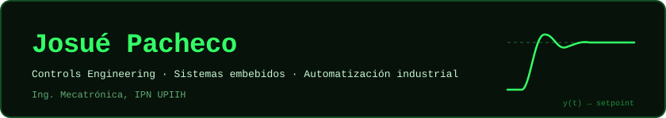
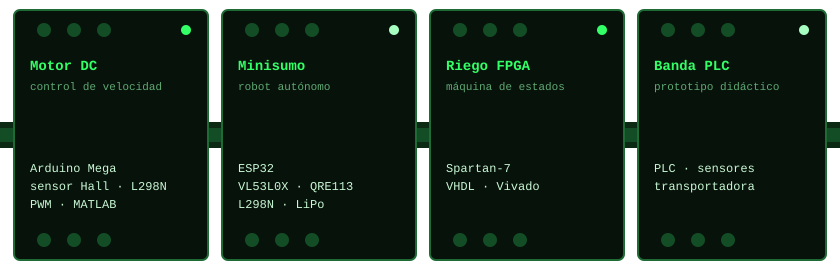

  

  

## Sobre mí

Estudio Ingeniería Mecatrónica en la UPIIH del IPN. Me enfoco en control y sistemas embebidos: modelar una planta, diseñar el controlador y llevarlo a hardware real, desde microcontroladores y FPGA hasta PLC. Mi objetivo es trabajar en automatización para la industria automotriz.

## Proyectos

  

| Proyecto | Qué hace | Tecnologías |
|---|---|---|
| [Control de motor DC](https://github.com/JosuePacheco05/motor-dc) | Regula la velocidad con retroalimentación de un sensor Hall; modelado previo en MATLAB | Arduino Mega, L298N, PWM, MATLAB |
| [Minisumo autónomo](https://github.com/JosuePacheco05/minisumo-esp32) | Detecta al oponente y el borde del dohyo para competir sin control remoto | ESP32, VL53L0X/L1X, QRE113 |
| [Riego en FPGA](https://github.com/JosuePacheco05/riego-fpga) | Controla el riego con una máquina de estados descrita en hardware | Spartan-7, VHDL, Vivado |
| [Banda transportadora](https://github.com/JosuePacheco05/banda-plc) | Prototipo didáctico de automatización con PLC | PLC, sensores |

## Herramientas

  

  
  
  
  
  
  

## Certificaciones

| Certificación | Emisor |
|---|---|
| CSWA, Certified SOLIDWORKS Associate | Dassault Systèmes |
| PCB Basic Design | Altium Education |
| MATLAB Onramp | MathWorks |
| Python | Santander Open Academy |
| Introducción a la Ciencia de Datos | Santander / IE University |
| Data & Cybersecurity | Campus BBVA / Coursera |

## Contacto

